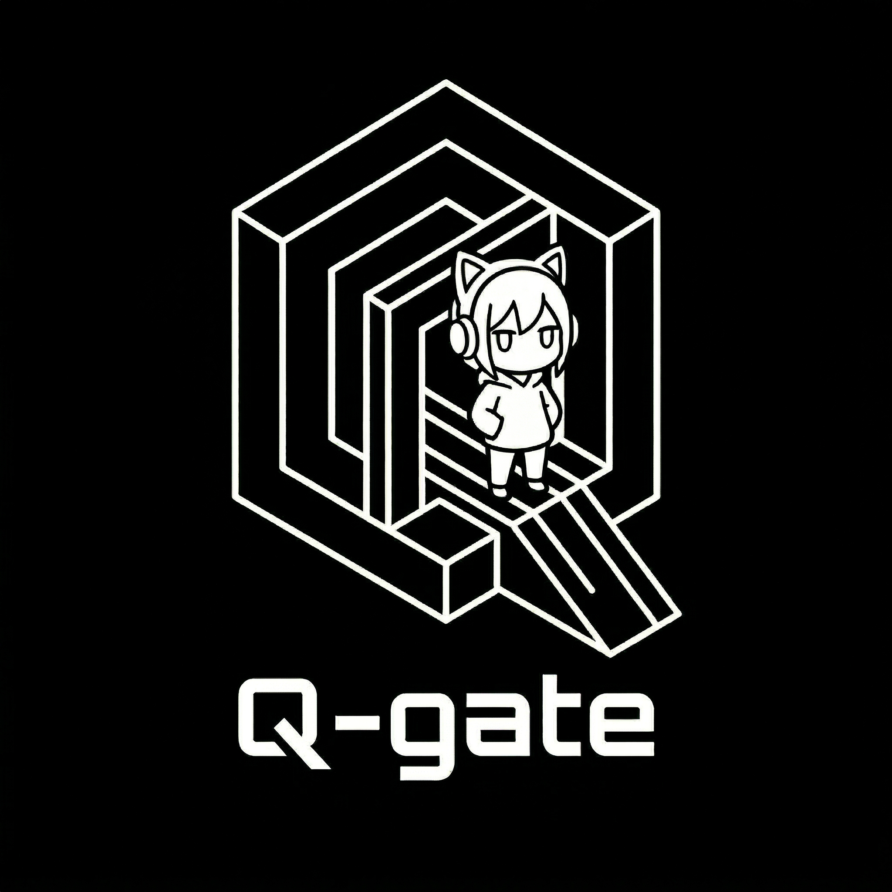
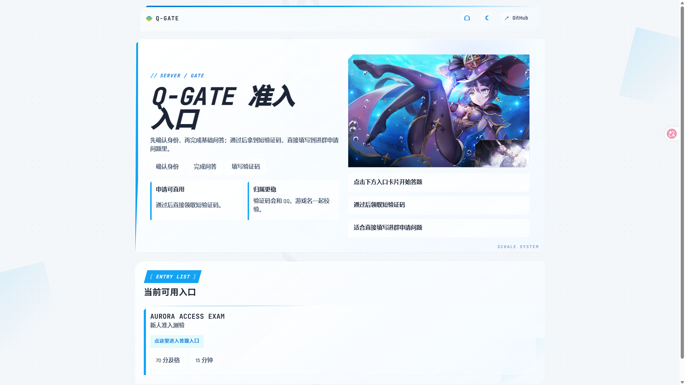

<p align="center">
  
</p>

<div align="center">

# Q-gate

_一个面向 Minecraft 白名单、进群审核与社区准入场景的轻量答题框架。_

简单 · 轻量 · 好看

<p>
  <a href="https://github.com/YRRLYB/Q-gate"></a>
  
  
  
  
  
  
</p>

<p>
  <a href="#快速开始">快速开始</a> ·
  <a href="#管理端">管理端</a> ·
  <a href="#使用流程">使用流程</a> ·
  <a href="#配置说明">配置说明</a>
</p>

</div>

<p align="center">
  
</p>

---

## 项目介绍

Q-gate 是一个偏向 Minecraft 白名单、进群审核和社区准入场景的轻量答题框架。

- 题库与站点文案尽量都用 YAML 维护
- 前端是 React + Vite，后端是 Fastify
- 运行态已经切到 SQLite，结构更稳也更适合长期维护
- 默认视觉就是可直接改品牌后上线的清爽科幻风

## 项目特点
- **身份绑定校验**
  - 验证码会绑定到 `QQ + Minecraft 用户名`，适合做进群或白名单校验。
- **管理端维护流程**
  - 管理端改成密码登录，并且每次重新进入都强制重新验证。
- **多媒体题目支持**
  - 支持图片、音频、视频题目，首页图和绑定页图既能填 `http/https`，也能填站内相对路径。
- **SQLite 运行态**
  - 比原来的 JSON 运行态更稳，后续扩展统计和记录也更方便。
- **配置优先**
  - 品牌名、文案、图片、题库和仓库链接都可以集中配置，二改门槛很低。

## 项目结构

- `apps/web`
  - 用户端答题页面 + 管理工作台
- `apps/api`
  - 出题、判分、验证码校验、管理接口
- `apps/api/data/starter-quiz.yaml`
  - 默认题库
- `apps/api/data/site-settings.yaml`
  - 品牌名、页面文案、按钮、图片地址、仓库链接
- `apps/api/data/runtime/runtime.sqlite`
  - 运行态数据库

## 快速开始

先准备配置文件：

```powershell
Copy-Item apps/api/.env.example apps/api/.env
Copy-Item apps/web/.env.example apps/web/.env
```

安装依赖并启动：

```bash
npm install
npm run dev:api
npm run dev:web
```

构建：

```bash
npm run build
```

默认本地地址：

- 用户端：`http://localhost:5173`
- 管理端：`http://localhost:5173/admin`
- API：`http://localhost:4100/api`

## 管理端

管理端没有单独的前端端口，默认直接挂在 Web 的 `/admin` 路由下，但更重要的是它能直接承担日常维护工作。

- 本地开发入口：`http://localhost:5173/admin`
- 生产环境入口：`你的站点地址/admin`
- 管理密码读取 `apps/api/.env` 里的 `ADMIN_PASSWORD`
- 浏览器可以保存密码，但每次重新进入管理端仍需要再次登录

管理端现阶段可用功能：

1. 编辑并发布题库，支持可视化编辑和 YAML 高级模式。
2. 编辑并发布站点文案，包括品牌名、按钮文案、页面标题、副标题和说明文字。
3. 修改首页图、绑定页图和仓库链接这类站点资源入口。
4. 直接热更新到前台页面，不需要每次都去翻源码改 React 组件。

## 使用流程

使用流程：

1. 打开首页，选择对应入口。
2. 在绑定页填写 `QQ` 和 `Minecraft 用户名`。
3. 进入答题页完成问答并提交。
4. 通过后复制短验证码。
5. 把验证码填写到进群申请问题，或者交给 bot 调用校验接口验证。

如果题库要求全屏，系统会在正式开始前就拦截并提醒。

## 配置说明

`apps/api/.env`：

```bash
PORT=4100
APP_ORIGIN=http://localhost:5173,http://127.0.0.1:5173
ADMIN_PASSWORD=replace-with-your-password
TOKEN_SECRET=replace-with-a-very-long-random-secret
DATA_DIR=./data/runtime
QUIZ_SEED_FILE=./data/starter-quiz.yaml
SITE_SETTINGS_FILE=./data/site-settings.yaml
TOKEN_TTL_MINUTES=20
ADMIN_SESSION_TTL_HOURS=12
```

字段说明：

- `PORT`：API 服务端口。
- `APP_ORIGIN`：允许访问 API 的前端来源，多个地址用逗号分隔。
- `ADMIN_PASSWORD`：管理端登录密码。
- `TOKEN_SECRET`：验证码和会话签名用的密钥，部署时建议换成长随机串。
- `DATA_DIR`：运行时数据目录，SQLite 会落在这里。
- `QUIZ_SEED_FILE`：题库 YAML 文件路径。
- `SITE_SETTINGS_FILE`：站点配置 YAML 文件路径。
- `TOKEN_TTL_MINUTES`：用户拿到的验证码有效期，单位分钟。
- `ADMIN_SESSION_TTL_HOURS`：管理端会话有效期，单位小时。

`apps/web/.env`：

```bash
VITE_API_BASE=http://localhost:4100/api
```

字段说明：

- `VITE_API_BASE`：前端请求的 API 基地址。

补充说明：

- 管理端优先读取 `ADMIN_PASSWORD`
- 旧字段 `ADMIN_KEY` 仍兼容，但新部署建议统一改成 `ADMIN_PASSWORD`
- 修改 API 密码后需要重启 API

## 内容维护

这套框架把高频修改点尽量集中到了少量文件里，所以改品牌、改题库、换图片都很方便：

1. `apps/api/data/starter-quiz.yaml`
   - 改题目、答案、分值、抽题规则。
2. `apps/api/data/site-settings.yaml`
   - 改站点名字、页面标题、按钮文案、说明文字。
3. `apps/api/data/site-settings.yaml` 里的 `media`
   - 改首页图、绑定页图和默认展示资源。

大多数维护者不需要进 React 源码就能接手这套项目。

## 多媒体支持

Q-gate 不只是普通选择题页面，也支持把内容做得更完整：

- 题目可以挂 `image`、`audio`、`video` 三种媒体资源。
- 首页图、绑定页图和题目媒体都可以使用远程 `http/https` 地址。
- 如果你把资源放到前端静态目录里，也可以直接写相对路径。
- 这意味着它既能做纯文本审核题，也能做带图规则说明、语音辨识题或视频引导题。

## 题库格式

```yaml
meta:
  slug: mc-whitelist
  title: Q-gate Access Exam
  subtitle: 新人准入测验
  description: 面向服务器白名单与社区审核的基础问答
  passScore: 70
  durationSec: 900
  shuffleQuestions: true
  examMode: closed_book
  requireFullscreen: false
  selectionMode: fixed

questions:
  - id: rule_01
    type: single
    group: objective
    points: 20
    prompt: 在主城展示建筑区域，哪种行为最不合规？
    options:
      - key: A
        text: 使用领地插件圈地后再施工
      - key: B
        text: 先阅读建筑区告示牌
      - key: C
        text: 未经说明直接爆破旧建筑
      - key: D
        text: 在公共仓库登记材料借用
    answer:
      - C
```

文本题的 `answer` 支持多个关键词，当前逻辑按“答案里需要包含这些关键词”来判断。

题目也支持附带媒体，例如：

```yaml
  - id: guide_02
    type: single
    group: objective
    points: 10
    prompt: 看图判断，下面哪种建筑行为不符合要求？
    media:
      type: image
      url: /images/build-rule.png
      caption: 建筑区示意图
    options:
      - key: A
        text: 先阅读区域说明
      - key: B
        text: 未经确认直接拆改公共建筑
    answer:
      - B
```

`media.url` 既可以写 `/images/build-rule.png` 这种相对路径，也可以直接写完整远程地址。

## 校验接口

这个接口给 bot、审核脚本或外部服务使用，用来校验某个短验证码是不是和指定的 `QQ + Minecraft 用户名` 对得上。

常见用途：

- 进群申请答案校验
- 群机器人自动审核
- 白名单通过前的二次确认

请求示例：

```http
POST /api/integrations/verify
Content-Type: application/json

{
  "code": "483291",
  "qq": "123456789",
  "playerName": "MyPlayer"
}
```

成功时表示这组身份和验证码匹配，且该次答题结果有效：

```json
{
  "valid": true,
  "status": "accepted",
  "attemptId": "att_xxx",
  "quizSlug": "mc-whitelist",
  "score": 80
}
```

失败时表示验证码不存在、已失效，或者与当前提交的 `QQ / playerName` 不匹配：

```json
{
  "valid": false,
  "status": "mismatch"
}
```
